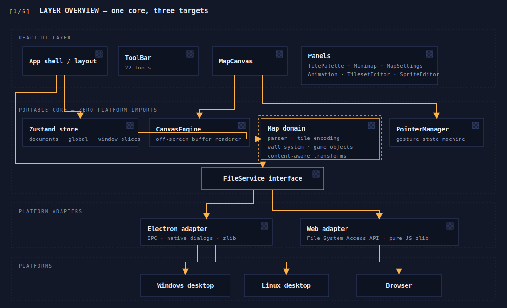
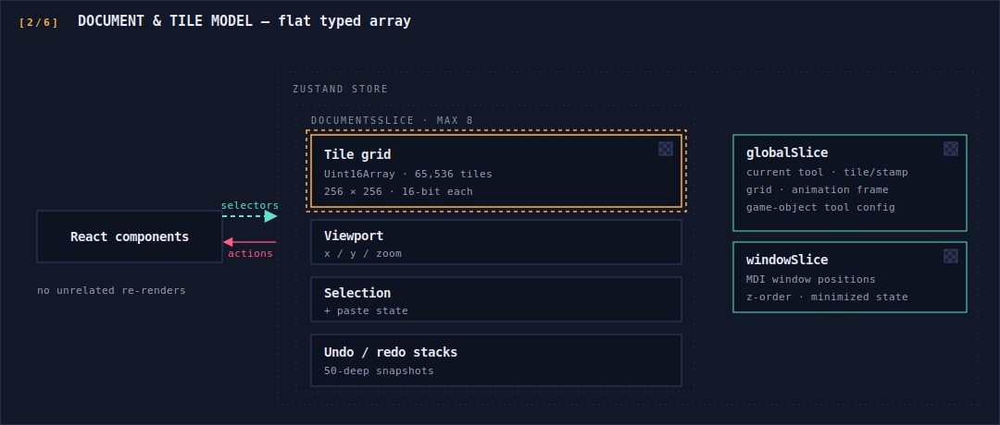
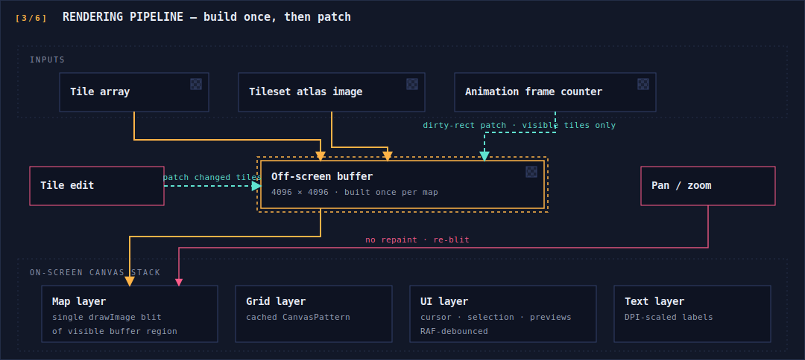
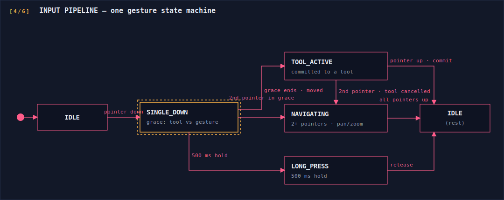
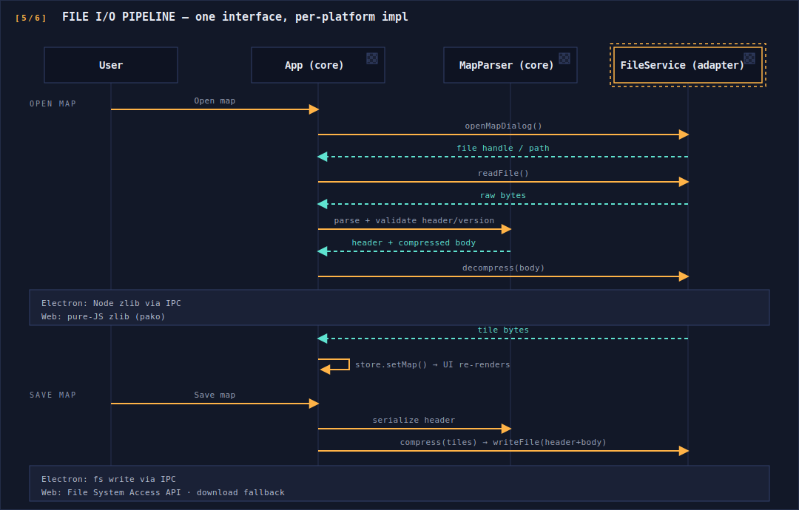
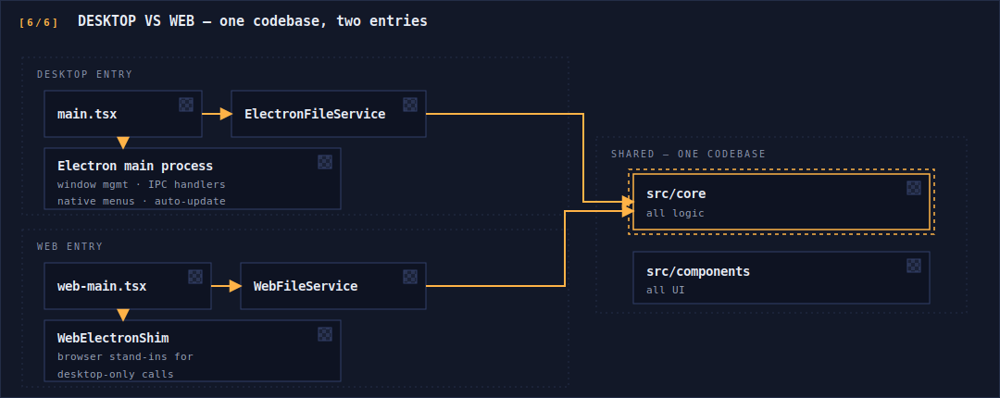

# Architecture

AC Map Editor is a layered React + TypeScript application in which **all domain logic is platform-agnostic** and platform capability (file dialogs, file I/O, compression) is injected through adapters. The same core and UI ship in three targets: Electron on Windows, Electron on Linux, and a static web build that runs entirely in the browser.

## Layer Overview



**Dependency rule:** arrows only point downward. `src/core/` imports nothing from Electron, the DOM file APIs, or React components. Adapters implement core interfaces; entry points wire them up.

## Document & Tile Model

The editor is multi-document (MDI): up to eight maps open simultaneously, each an independent document object.



Key model decisions:

- **Flat typed array, not objects.** A map is a single `Uint16Array` — cache-friendly, trivially snapshottable for undo, and mirrors the on-disk representation, so serialization is cheap.
- **Semantic layers are derived, not stored.** Walls, animated tiles, and game objects are all encodings *within* the 16-bit tile value; systems like the wall connector and transform engine interpret them on demand. (The exact bit layout is intentionally not documented here.)
- **Snapshot undo with drag batching.** A drag stroke accumulates tile changes in a pending map and commits once — one undo entry per user gesture, not per tile.

## Rendering Pipeline

Rendering uses plain Canvas2D, structured as four stacked canvases over one full-resolution off-screen buffer.



Why this shape:

- The expensive operation (rasterizing 65,536 tiles) happens **once** per map load; everything after is an incremental patch or a blit.
- Animated tiles never trigger a full repaint — each frame tick patches only the animated tiles currently in view.
- WebGL was evaluated and deliberately rejected: for an atlas-blit workload of this size, Canvas2D `drawImage` is already hardware-accelerated, and the measured bottlenecks were state management, not rasterization.
- The engine is a standalone class detached from the React lifecycle: it subscribes directly to the store, and mount/unmount is an explicit `attach`/`detach` with cleanup, which keeps React reconciliation out of the hot path.

## Input Pipeline



All mouse, touch, and pen events are normalized by a `PointerManager` before any tool sees them. Its phase enum is the whole contract:

```typescript
export enum GesturePhase {
  IDLE = 'IDLE',
  SINGLE_DOWN = 'SINGLE_DOWN',   // grace window: tool vs. gesture undecided
  TOOL_ACTIVE = 'TOOL_ACTIVE',   // committed to a tool action
  NAVIGATING = 'NAVIGATING',     // 2+ pointers: pan/zoom
  LONG_PRESS_FIRED = 'LONG_PRESS_FIRED',
}
```

The canvas component receives disambiguated callbacks (`onToolDown/Move/Up`, `onPanMove`, `onZoom`, `onUndo`, `onLongPress`) — it contains no gesture logic of its own. Pen detection enables palm rejection: touch input is ignored for tool actions while a stylus is active, but two-finger navigation still works.

## File I/O Pipeline

Maps are a binary format: a versioned header plus a compressed tile block (concept level — the layout itself is not documented publicly). The pipeline is identical on every platform; only the `FileService` implementation differs.



The abstraction boundary is a small async interface; every operation returns a result object rather than throwing across the boundary:

```typescript
export interface FileService {
  openMapDialog(): Promise<FileDialogResult>;
  saveMapDialog(defaultPath?: string): Promise<FileDialogResult>;
  readFile(filePath: string): Promise<FileReadResult>;
  writeFile(filePath: string, data: ArrayBuffer): Promise<FileWriteResult>;
  compress(data: ArrayBuffer): Promise<CompressionResult>;
  decompress(data: ArrayBuffer): Promise<CompressionResult>;
}
```

## Desktop vs. Web Split



Each target has its own HTML shell and Vite config; the entry point is the only place that knows which platform it is:

```tsx
// web entry point — inject the browser adapter before mounting
installWebElectronShim();
const fileService = new WebFileService();

ReactDOM.createRoot(document.getElementById('root')!).render(
  <FileServiceProvider service={fileService}>
    <App />
  </FileServiceProvider>
);
```

Desktop-only concerns (native menu bar, auto-updater, patch-folder scanning) degrade gracefully on the web via the shim; web-only concerns (File System Access API fallbacks, download-based save) live entirely inside the web adapter. On Electron, the renderer runs with context isolation on and Node integration off — all privileged operations cross a typed preload bridge.

## Cross-Cutting Notes

- **Error handling:** result objects (`{ success, data?, error? }`) end-to-end for file, parse, and compression operations; format validation (magic number, version) happens before any tile data is touched.
- **Coordinates:** the viewport works in fractional tile units, not pixels — zoom (0.25×–4×, cursor-anchored) and visible-tile culling fall out naturally.
- **Performance targets held in practice:** sub-millisecond tile patches, ~1 ms blits, ~8 ms input-to-paint.
